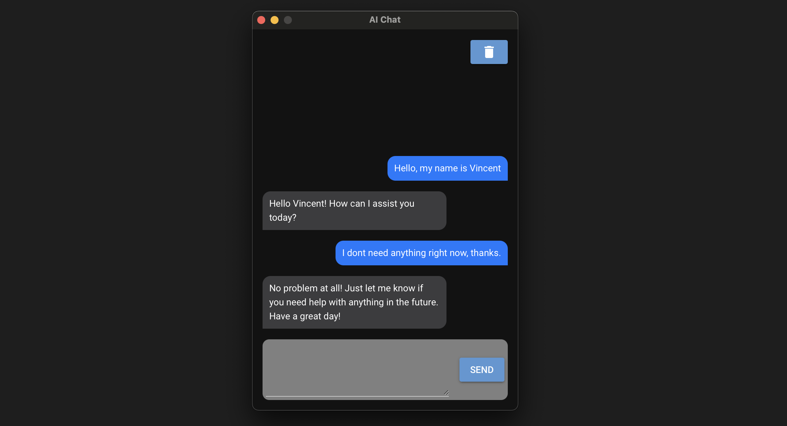

# AI Chatbot App

A python project that utilizes OpenAI API with Pinecone vector database, to create a long term memory AI chat. App is styled using NiceGUI.

## Features
- **AI API:** OpenAI API, 
- **Embeddings:** Model: text-embedding-3-small, Dimension: 512
- **Vector DB:** Pinecone
- **UI:** NiceGUI



## Installation:

- Clone Repository
```sh
git clone https://github.com/Systemized/AI-Chat.git
```

- Create an .env file in root, with the following
```
OpenAI_Key="<your-openai-api-key>"
Pinecone_Key="<your-pinecone-key>"
```

- Install dependencies & run
```sh
pip install .
python main.py
```